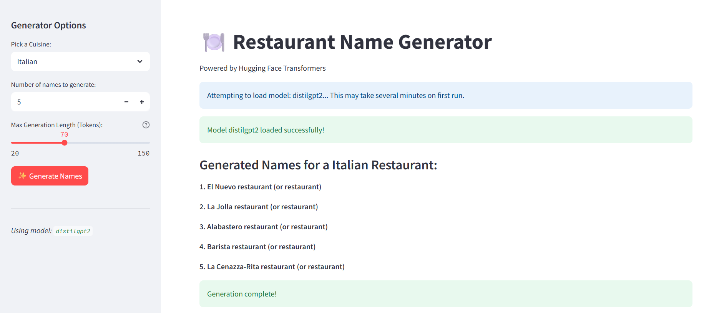

# 🍽️ AI Restaurant Name Generator

[](https://www.python.org/)
[](https://streamlit.io)
[](https://huggingface.co/transformers)
[](https://opensource.org/licenses/MIT)

A web application built with Streamlit and Hugging Face Transformers to generate creative and relevant restaurant names based on a selected cuisine type.



## Table of Contents

-   [Features](#features)
-   [How It Works](#how-it-works)
-   [Technology Stack](#technology-stack)
-   [Setup and Installation](#setup-and-installation)
-   [Running the Application](#running-the-application)
-   [Project Structure](#project-structure)
-   [Future Enhancements](#future-enhancements)
-   [License](#license)
-   [Author](#author)

## Features

-   **Cuisine-Specific Generation:** Select from a predefined list of popular cuisines (Italian, Mexican, Indian, etc.).
-   **Customizable Output:** Specify the desired number of restaurant name suggestions.
-   **Adjustable Creativity:** Control the maximum generation length (in tokens) to influence the complexity and variety of names.
-   **AI-Powered:** Leverages a pre-trained language model (`distilgpt2` or others) from the Hugging Face Hub for text generation.
-   **Efficient Model Loading:** Uses Streamlit's `@st.cache_resource` to load the language model only once, improving performance on subsequent runs.
-   **Output Cleaning:** Implements basic regular expressions and filtering to extract plausible restaurant names from the raw model output.
-   **Interactive UI:** Built with Streamlit for an easy-to-use web interface.
-   **GPU Acceleration:** Automatically utilizes a GPU if available (via PyTorch and `transformers`) for faster inference.

## How It Works

1.  **Model Loading:** On the first run, the application downloads and loads the specified Hugging Face `transformers` text-generation pipeline (`distilgpt2` by default). This process is cached using `st.cache_resource` for speed.
2.  **User Input:** The user selects a cuisine type, the desired number of names, and the maximum token length for the generation via the Streamlit sidebar.
3.  **Prompt Engineering:** A detailed prompt is constructed based on the user's input. This prompt guides the language model by providing context, examples of desired output format, and keywords related to the cuisine.
4.  **Text Generation:** The prompt is fed into the loaded `transformers` pipeline. The model generates multiple text sequences based on the prompt and parameters like `temperature`, `top_k`, and `max_new_tokens`.
5.  **Output Processing:** The raw generated text from the model is processed by a helper function (`clean_generated_names`). This function attempts to extract potential restaurant names by splitting lines, removing numbering/bullets, filtering based on length, and excluding common instruction-like phrases.
6.  **Display Results:** The cleaned, unique names are presented to the user in the main area of the Streamlit application.

## Technology Stack

-   **Language:** Python 3.8+
-   **Web Framework:** Streamlit
-   **Machine Learning / NLP:**
    -   Hugging Face `transformers` library
    -   PyTorch (or TensorFlow, depending on `transformers` backend)
    -   Pre-trained Model: `distilgpt2` (configurable)
-   **Core Libraries:** `re` (Regular Expressions), `time`, `sys`

## Setup and Installation

1.  **Clone the repository:**
    ```bash
    git clone https://github.com/CODEAFSARA/restaurant-name-generator.git
    cd restaurant-name-generator
    ```

2.  **Create and activate a virtual environment (Recommended):**
    ```bash
    # Using venv
    python -m venv venv
    source venv/bin/activate  # On Windows use `venv\Scripts\activate`

    # Or using conda
    # conda create -n restaurant-gen python=3.9
    # conda activate restaurant-gen
    ```

3.  **Install dependencies:**
    Create a `requirements.txt` file with the following content:
    ```txt
    streamlit
    transformers
    torch # Or tensorflow if you prefer that backend
    # Add any other specific libraries you might use
    ```
    Then install them:
    ```bash
    pip install -r requirements.txt
    ```
    *Note: Installing PyTorch might require specific commands depending on your OS and CUDA version if you plan to use GPU. Refer to the [official PyTorch website](https://pytorch.org/get-started/locally/) for instructions.*

4.  **(Optional) CUDA Setup:** If you have an NVIDIA GPU and want faster performance, ensure you have the NVIDIA drivers, CUDA Toolkit, and cuDNN installed, and install the appropriate PyTorch version with CUDA support. The script automatically attempts to use the GPU if `torch.cuda.is_available()` returns `True`.

## Running the Application

Once the setup is complete, run the Streamlit application from your terminal:

```bash
streamlit run streamlit run app.py